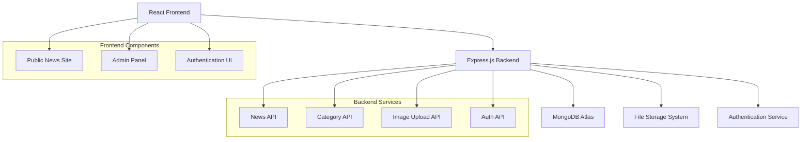

# Design Document

## Overview

The Dominica News CMS will be built as a fullstack application with a React frontend and Node.js/Express backend. The system will use MongoDB Atlas for data persistence and implement a RESTful API architecture. The existing React frontend will be enhanced with admin functionality, while a new backend will handle all data operations, authentication, and file management.

## Architecture

### High-Level Architecture



### Technology Stack

**Frontend:**
- React 18 with TypeScript
- React Router for navigation
- TanStack Query for API state management
- Shadcn/ui components (already integrated)
- Tailwind CSS for styling
- React Hook Form with Zod validation

**Backend:**
- Node.js with Express.js
- TypeScript for type safety
- MongoDB Atlas with Mongoose ODM
- JWT for authentication
- Multer for file uploads
- bcrypt for password hashing
- express-rate-limit for API protection

**Infrastructure:**
- Local file storage for images (with option to extend to cloud storage)
- Environment-based configuration
- CORS configuration for frontend-backend communication

## Components and Interfaces

### Database Schema (MongoDB Collections)

```javascript
// Users collection for admin authentication
const userSchema = {
  _id: ObjectId,
  email: String, // unique index
  passwordHash: String,
  fullName: String,
  role: String, // default: 'admin'
  createdAt: Date, // default: new Date()
  updatedAt: Date // default: new Date()
};

// Categories collection
const categorySchema = {
  _id: ObjectId,
  name: String, // unique index
  slug: String, // unique index
  description: String,
  displayOrder: Number, // default: 0
  createdAt: Date // default: new Date()
};

// Articles collection
const articleSchema = {
  _id: ObjectId,
  title: String,
  slug: String, // unique index
  excerpt: String,
  content: String,
  featuredImage: String,
  categoryId: ObjectId, // reference to categories
  authorId: ObjectId, // reference to users
  status: String, // default: 'draft'
  publishedAt: Date,
  createdAt: Date, // default: new Date()
  updatedAt: Date // default: new Date()
};

// Images collection for media management
const imageSchema = {
  _id: ObjectId,
  filename: String,
  originalName: String,
  filePath: String,
  fileSize: Number,
  mimeType: String,
  width: Number,
  height: Number,
  uploadedBy: ObjectId, // reference to users
  createdAt: Date // default: new Date()
};
```

### API Endpoints

**Authentication Endpoints:**
- `POST /api/auth/login` - Admin login
- `POST /api/auth/register` - Admin registration (restricted)
- `POST /api/auth/logout` - Logout
- `GET /api/auth/me` - Get current user info

**Articles Endpoints:**
- `GET /api/articles` - Get published articles (public)
- `GET /api/articles/:slug` - Get single article (public)
- `GET /api/admin/articles` - Get all articles (admin)
- `POST /api/admin/articles` - Create article (admin)
- `PUT /api/admin/articles/:id` - Update article (admin)
- `DELETE /api/admin/articles/:id` - Delete article (admin)

**Categories Endpoints:**
- `GET /api/categories` - Get all categories (public)
- `GET /api/categories/:slug/articles` - Get articles by category (public)
- `POST /api/admin/categories` - Create category (admin)
- `PUT /api/admin/categories/:id` - Update category (admin)
- `DELETE /api/admin/categories/:id` - Delete category (admin)

**Images Endpoints:**
- `POST /api/admin/images/upload` - Upload image (admin)
- `GET /api/admin/images` - Get all images (admin)
- `DELETE /api/admin/images/:id` - Delete image (admin)
- `GET /api/images/:filename` - Serve image (public)

### Frontend Component Structure

```
src/
├── components/
│   ├── ui/ (existing Shadcn components)
│   ├── admin/
│   │   ├── AdminLayout.tsx
│   │   ├── ArticleEditor.tsx
│   │   ├── ArticleList.tsx
│   │   ├── CategoryManager.tsx
│   │   ├── ImageManager.tsx
│   │   └── Dashboard.tsx
│   ├── public/
│   │   ├── Header.tsx
│   │   ├── Footer.tsx
│   │   ├── ArticleCard.tsx
│   │   ├── ArticleDetail.tsx
│   │   └── CategoryNav.tsx
│   └── shared/
│       ├── ProtectedRoute.tsx
│       ├── LoadingSpinner.tsx
│       └── ErrorBoundary.tsx
├── pages/
│   ├── Index.tsx (enhanced)
│   ├── Auth.tsx (enhanced)
│   ├── CategoryPage.tsx (enhanced)
│   ├── ArticlePage.tsx (new)
│   └── admin/
│       ├── AdminDashboard.tsx
│       ├── AdminArticles.tsx
│       ├── AdminCategories.tsx
│       └── AdminImages.tsx
├── hooks/
│   ├── useAuth.ts
│   ├── useArticles.ts
│   ├── useCategories.ts
│   └── useImages.ts
├── services/
│   ├── api.ts
│   ├── auth.ts
│   ├── articles.ts
│   ├── categories.ts
│   └── images.ts
└── types/
    ├── auth.ts
    ├── article.ts
    ├── category.ts
    └── image.ts
```

## Data Models

### TypeScript Interfaces

```typescript
interface User {
  id: number;
  email: string;
  fullName: string;
  role: 'admin' | 'user';
  createdAt: string;
}

interface Category {
  id: number;
  name: string;
  slug: string;
  description?: string;
  displayOrder: number;
  articleCount?: number;
}

interface Article {
  id: number;
  title: string;
  slug: string;
  excerpt?: string;
  content: string;
  featuredImage?: string;
  category: Category;
  author: User;
  status: 'draft' | 'published';
  publishedAt?: string;
  createdAt: string;
  updatedAt: string;
}

interface Image {
  id: number;
  filename: string;
  originalName: string;
  filePath: string;
  fileSize: number;
  mimeType: string;
  width?: number;
  height?: number;
  uploadedBy: number;
  createdAt: string;
}
```

## Error Handling

### Backend Error Handling
- Centralized error middleware for consistent error responses
- Validation errors return 400 with detailed field information
- Authentication errors return 401 with clear messages
- Authorization errors return 403 with appropriate context
- Not found errors return 404 with resource information
- Server errors return 500 with sanitized error messages
- All errors logged with appropriate severity levels

### Frontend Error Handling
- React Error Boundaries for component-level error catching
- TanStack Query error handling for API failures
- Form validation errors displayed inline
- Global toast notifications for system-level errors
- Retry mechanisms for transient failures
- Graceful degradation for non-critical features

## Testing Strategy

### Backend Testing
- Unit tests for all service functions using Jest
- Integration tests for API endpoints using Supertest
- Database tests using test database with cleanup
- Authentication middleware testing
- File upload functionality testing

### Frontend Testing
- Component unit tests using React Testing Library
- Integration tests for user workflows
- API integration tests using MSW (Mock Service Worker)
- Form validation testing
- Authentication flow testing

### End-to-End Testing
- Critical user journeys using Playwright
- Admin workflow testing (create, edit, delete articles)
- Public site functionality testing
- Cross-browser compatibility testing

## Security Considerations

### Authentication & Authorization
- JWT tokens with appropriate expiration times
- Password hashing using bcrypt with salt rounds
- Role-based access control for admin functions
- Secure session management
- CSRF protection for state-changing operations

### Data Validation
- Input sanitization to prevent XSS attacks
- NoSQL injection prevention through Mongoose validation
- File upload validation (type, size, content)
- Rate limiting on all API endpoints
- Request size limits to prevent DoS attacks

### Infrastructure Security
- Environment variables for sensitive configuration
- HTTPS enforcement in production
- CORS configuration for allowed origins
- Security headers (helmet.js)
- Regular dependency updates and vulnerability scanning

## Performance Optimization

### Backend Performance
- MongoDB indexing on frequently queried fields (email, slug, categoryId)
- Connection pooling through Mongoose
- Caching strategies for frequently accessed data
- Image optimization and thumbnail generation
- Pagination for large data sets using MongoDB skip/limit

### Frontend Performance
- Code splitting for admin and public routes
- Image lazy loading and optimization
- TanStack Query caching for API responses
- Bundle optimization and tree shaking
- Progressive loading for article content

## Deployment Considerations

### Development Environment
- Docker containers for consistent development setup
- Environment-specific configuration files
- Database seeding scripts for initial data
- Hot reloading for both frontend and backend

### Production Deployment
- Build optimization for frontend assets
- MongoDB Atlas configuration and backup
- File storage backup and recovery
- Monitoring and logging setup
- Health check endpoints for load balancers